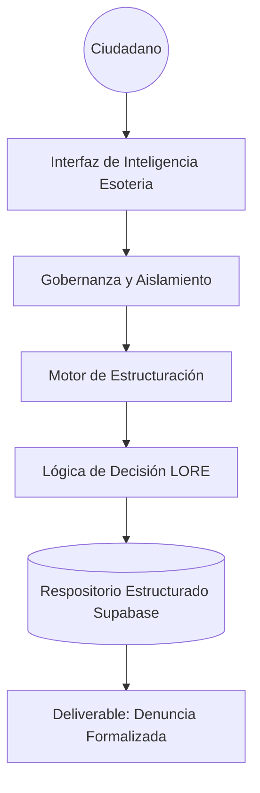

# White Paper: Denuncia Popular v2.5
**Gobernanza de Inteligencia para la Justicia Ambiental: El Modelo de Estructuración de Esoteria**

**Versión:** 2.5 (Governance-First)  
**Fecha:** Febrero 2026  
**Estatus:** Infraestructura Certificada  
**Ecosistema:** [Esoteria Intelligence Infrastructure](https://esoteria.ai)  
**Autor:** Esoteria Governance Engineering  

---

## 1. Tesis Ejecutiva

Las organizaciones y ciudadanos no sufren por falta de información, sino por falta de **estructura**.  
Indignación acumulada sin modelado legal es ruido administrativo.

**Denuncia Popular** opera como una capa de infraestructura inteligente que transforma la fragmentación de un incidente ambiental en una entidad estructurada, auditable y procesable. No es un chatbot; es un motor de gobernanza que formaliza la lógica de decisión legal antes de la ejecución.

---

## 2. El Problema: Fragmentación y Dependencia

La justicia administrativa en México (Art. 189 LGEEPA) falla por tres debilidades estructurales:
1.  **Ambigüedad Narrativa:** Hechos sin modelado jurídico.
2.  **Imprecisión Espacial:** Datos de ubicación sin contexto de propiedad o jurisdicción.
3.  **Fragilidad Procedural:** Dependencia en el criterio humano inconsistente en lugar de sistemas de lógica explícita.

---

## 3. Filosofía de Gobernanza Primero

Bajo el ecosistema **Esoteria Workbench**, implementamos el **Modelo de Inteligencia por Capas**:

### Capa 0 — Gobernanza y Límites
Definimos las fronteras del conjunto de datos. La información del ciudadano permanece aislada y gobernada bajo políticas de privacidad física y lógica.

### Capa 1 — Inventario de Hechos
Antes de la interpretación, identificamos qué datos existen: coordenadas, testimonios, evidencia multimedia.

### Capa 2 — Estructuración de Entidades
Los datos crutos se convierten en entidades modeladas: Ofensor, Daño Ambiental, Ubicación Jurisdiccional.

### Capa 3 — Lógica de Decisión (LORE)
Aplicamos criterios de ponderación transparentes para determinar la competencia (Municipal, Estatal, Federal) y el fundamento legal aplicable. La lógica es explícita, no intuitiva.

---

## 4. Arquitectura de Inteligencia Estructural

### Componentes de Infraestructura
*   **Lógica Procedural:** Motor de análisis basado en modelos de lenguaje gobernados.
*   **Geolocalización de Precisión:** Integración de Google Maps con lógica de dirección manual para integridad de datos.
*   **Segregación de Entornos:** Despliegue en GCP bajo estrictas políticas de IAM y Billing de Esoteria.

---

## 5. La Interfaz de Inteligencia

La interacción conversacional es solo la superficie. El objetivo no es "chatear", sino recolectar los componentes necesarios para la **Estructuración de Hechos**:
1.  **Identificación Espacial:** Georeferenciación precisa.
2.  **Entrevista de Hechos:** Extracción de Tiempo, Modo y Lugar.
3.  **Generación de Activos:** Producción de un reporte de inteligencia legal (PDF) listo para presentación oficial.

---

## 6. Seguridad y Ética de Datos

*   **Auditabilidad:** Cada paso de la estructuración es observable.
*   **Privacidad Local:** El procesamiento de generación de documentos ocurre en el cliente para minimizar la exposición de datos.
*   **Transparencia Procedural:** El usuario valida toda la lógica sugerida por el sistema antes de la firma.

---

## 7. Hoja de Ruta: Recalibración Estructural

| Fase | Hito | Propósito |
| :--- | :--- | :--- |
| **Q1 2026** | **Gobernanza Expandida** | Implementación de límites de workspace para diferentes tipos de delitos ambientales. |
| **Q2 2026** | **Automatización de Flujo** | Cadencia de seguimiento automatizado con autoridades. |
| **Q3 2026** | **Análisis de Clusters** | Identificación de patrones de degradación ambiental mediante modelado de entidades. |

---

## 8. Conclusión

**Denuncia Popular** no es una capa de IA sobre el caos. Es el sistema debajo de la claridad. Convertimos el juicio implícito en lógica explícita para devolver el poder del derecho ambiental a la ciudadanía mediante una infraestructura de gobernanza inatacable.

---

**Para más información:**
🏗️ [Esoteria Intelligence Infrastructure](https://esoteria.ai)  
📦 [GitHub Repository](https://github.com/Gorodev-lab/denuncia-popular)

---
*Este documento define la trayectoria doctrinaria de Esoteria para el proyecto Denuncia Popular v2.5.*
