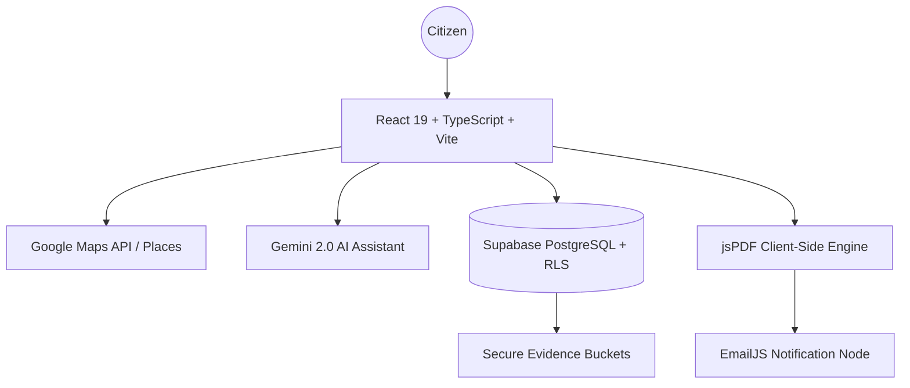

# White Paper: Denuncia Popular v2.5
**Democratizing Environmental Justice through Artificial Intelligence and the Esoteria AI Ecosystem**

**Version:** 2.5 (Gold Standard)  
**Date:** February 2026  
**Status:** Certified Production  
**Ecosystem:** [Esoteria AI Enterprise Ecosystem](https://esoteria.ai)  
**Author:** Antigravity Engineering & Esoteria AI Governance  

---

## 1. Mission Statement

**Denuncia Popular** is not just an application; it is a citizen empowerment tool designed to close the technical, legal, and bureaucratic gap that separates people from the protection of their environmental rights. Our mission is to transform citizen outrage into unassailable, actionable, and grounded legal documents, using frontier technologies to ensure every voice is heard by the competent authorities.

---

## 2. The Problem: The Administrative Justice Abyss

In the current architecture of the Mexican state (and much of Latin America), submitting a popular complaint (Art. 189 of the LGEEPA) faces three critical barriers:

1.  **Technical Complexity:** Accurately describing environmental damage requires knowledge that the average citizen does not possess.
2.  **Geographic Imprecision:** Many reports fail because authorities cannot locate the exact site of the incident ("Behind the hill", "Near the river").
3.  **Legal Vulnerability:** A report without a legal basis is easily dismissed by authorities, perpetuating impunity.

---

## 3. The Solution: The "Denuncia Popular" Ecosystem

Our platform integrates a **Triangle of Effectiveness** technology:

### 3.1 Generative AI (LORE)
Using **Google Gemini 2.0 Flash**, the platform acts as a "Pocket Legal Consultant." The AI:
*   Conducts conversational triage to extract relevant facts.
*   Translates colloquial language into technical-legal terms.
*   Automatically classifies the type of violation (water, air, soil, biodiversity).

### 3.2 Enterprise-Grade Geolocation (MAPS)
Following the critical v2.2 migration, we integrated **Google Maps Platform** to offer:
*   **Millimetric Precision:** Use of satellite and relief layers for precise identification of landfills, illegal logging, or spills.
*   **Local-Sourced Logic (LSL):** A proprietary innovation that allows users to edit the auto-detected address ("In front of the blue warehouse") while maintaining pure GPS coordinates. This ensures authorities reach the exact site without confusion.

### 3.3 Data Governance and Security (SHIELD)
We operate under the **Esoteria AI** ecosystem, which implies:
*   **Infrastructure as Code (IaC):** Strict deployment on GCP with segregated environments (Sandbox, Dev, Prod).
*   **Extreme RLS Policies:** The database (Supabase/PostgreSQL) uses Row Level Security to ensure collected evidence is immutable and tamper-proof.

---

## 4. High Availability Architecture

### Certified Tech Stack
*   **Core:** React 19 / TypeScript 5.8 / Vite 6.
*   **UI/UX:** Esoteric design system based on Zinc-950 with fractal micro-animations and premium Dark Mode.
*   **Maps:** Google Maps SDK (Maps, Geocoding, Places API).
*   **AI Engine:** Google Gemini 2.0 Flash SDK.
*   **Backend:** Supabase with Row Level Security (RLS).
*   **Infrastructure:** GCP Projects governed by Esoteria Billing & IAM.

---

## 5. User Experience (UX/UI)

Designed under the **"Zero Friction"** principle, the application guides users through a 4-step Wizard:

1.  **Local Identification:** Interaction with a dynamic map optimized for mobile where users "pin" the incident.
2.  **Assisted Narrative:** The Gemini ChatBot asks specific details based on the detected context.
3.  **Multimedia Evidence:** Upload of photos and videos with intact location metadata.
4.  **Certificate Generation:** Instant issuance of a certified PDF that users can present to SEMARNAT, PROFEPA, or local authorities.

---

## 6. Security and AI Ethics

At Denuncia Popular, privacy is not an option, it is the foundation:
*   **Privacy by Design:** We do not store sensitive data that is not strictly necessary for the complaint.
*   **No-Cloud PDF:** The final document is generated on the client (browser), preventing sensitive legal information from traveling unnecessarily through intermediate servers.
*   **AI Transparency:** Every legal suggestion from the AI is verifiable, and users maintain full editorial control over the final draft.

---

## 7. Roadmap: Towards Ubiquitous Justice

| Phase | Milestone | Description |
| :--- | :--- | :--- |
| **Q1 2026** | **WhatsApp Bridge** | WhatsApp ChatBot integration for low-connectivity areas. |
| **Q2 2026** | **Blockchain Notarization** | Registration of complaint hashes on an L2 network for extreme legal immutability. |
| **Q3 2026** | **Open Data Dashboard** | Public heat map of environmental crimes for social auditing (preserving anonymity). |
| **Q4 2026** | **Latam Expansion** | Localization of environmental laws for Colombia, Chile, and Brazil. |

---

## 8. Conclusion

**Denuncia Popular** represents the perfect convergence of civics and high technology. Under the **Esoteria AI** umbrella, we have built a platform that not only reports problems but builds robust legal solutions. We are returning the power of environmental law to those who need it most: the people.

---

**For more information:**
🌐 [Denuncia Popular Portal](https://denuncia-popular.vercel.app)  
🏗️ [Esoteria AI Ecosystem](https://esoteria.ai)  
📦 [GitHub Repository](https://github.com/Gorodev-lab/denuncia-popular)

---
*This document is the intellectual property of Esoteria AI & Gorops. All rights reserved 2026.*
